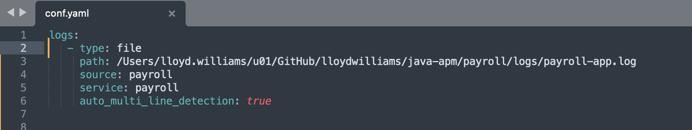
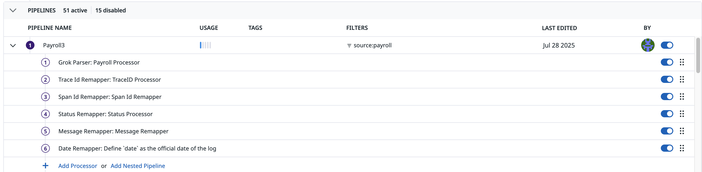
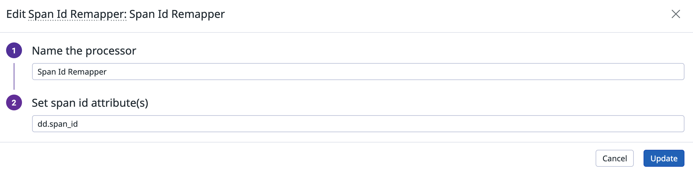
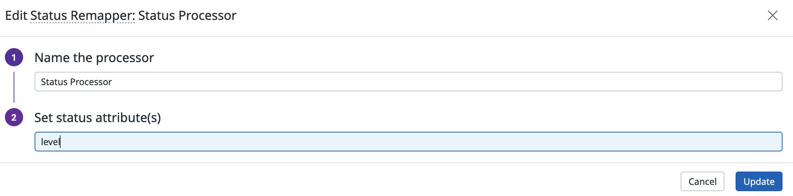
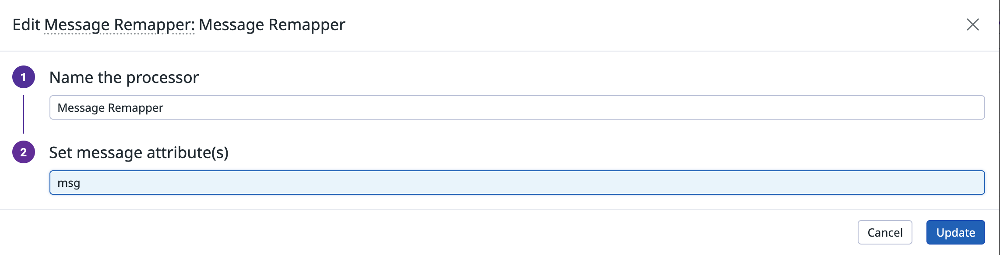
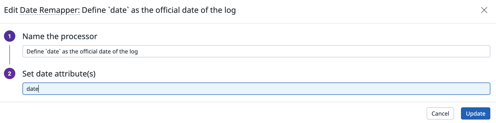
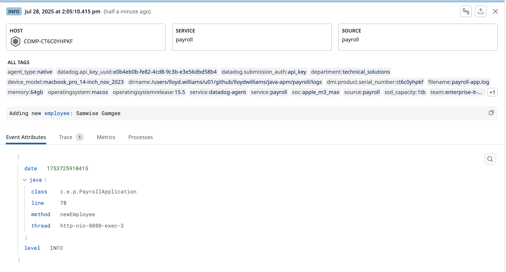
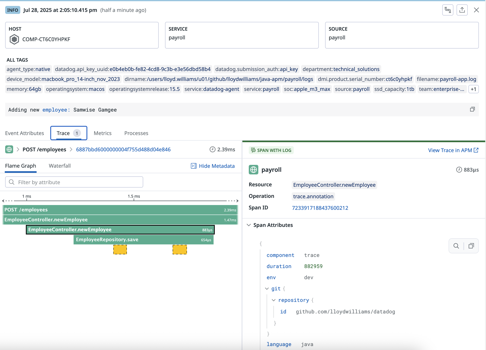
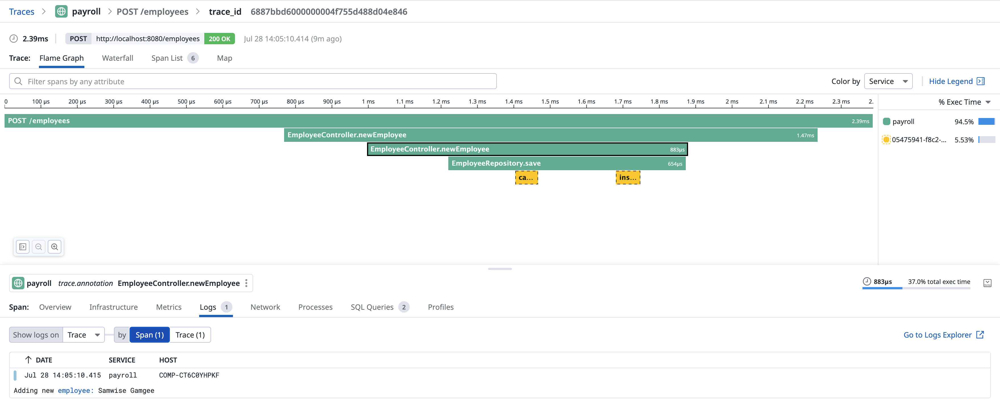

# Java Sringboot Payroll Example


Use `run-payroll.sh` to start the Springboot microservice. This uses Java JDK 11. Install the JDK and modify the script to set or remove the JAVA_HOME variable.

Use `curl_payroll_2.sh` to send two test messages. This is using [CURL](https://linuxize.com/post/curl-command-examples/) which you may need to install separately. 


## Configure Datadog Agent to Read the Logs

In the datadog agent folder under /etc/conf.d, create a new folder "payroll" and then a file "conf.yaml" to read the file and set the source and service and any other [advanced log collection rules](https://docs.datadoghq.com/agent/logs/advanced_log_collection). 




## Datadog Log Pipeline



#### 1 Grok Parser

Sample Log

```
2025-07-25T16:19:21.701+0000 INFO  [http-nio-8080-exec-2] [c.e.p.PayrollApplication newEmployee:78] [6883ae8900000000606341ff46e823e5] [5323179808417914461] Adding new employee: Samwise Gamgee
```

Grok Parsing Rules

```
payroll1 %{date("yyyy-MM-dd'T'HH:mm:ss.SSSZ"):date}\s+%{word:level}\s+\[%{data:java.thread}\]\s+\[%{data:java.class}\s+%{data:java.method}:%{number:java.line}\]\s+\[%{word:dd.trace_id}?\]\s+\[%{word:dd.span_id}?\]\s+%{data:msg}

date_status_cls %{date("yyyy-MM-dd'T'HH:mm:ss.SSSZ"):date}\s+%{word:level}\s+\[%{data:java.thread}\]\s+\[%{data:java.class}\s+%{data:java.method}:%{number:java.line}\]%{data:msg}

date_status_thr %{date("yyyy-MM-dd'T'HH:mm:ss.SSSZ"):date}\s+%{word:level}\s+\[%{data:java.thread}\]%{data:msg}

date_status_msg %{date("yyyy-MM-dd'T'HH:mm:ss.SSSZ"):date}\s+%{word:level}\s+%{data:msg}

date_message %{date("yyyy-MM-dd'T'HH:mm:ss.SSSZ"):date}\s+%{data:msg}

date_only %{date("yyyy-MM-dd'T'HH:mm:ss.SSSZ"):date}.*

message_default %{data:msg}
```

Result of matching on rule: payroll1

```
{
  "dd": {
    "trace_id": "6883ae8900000000606341ff46e823e5",
    "span_id": "5323179808417914461"
  },
  "msg": "Adding new employee: Samwise Gamgee",
  "date": 1753460361701,
  "java": {
    "method": "newEmployee",
    "line": 78,
    "thread": "http-nio-8080-exec-2",
    "class": "c.e.p.PayrollApplication"
  },
  "level": "INFO"
}

```


#### 2 Trace ID Remapper


#### 3 Span ID Remapper



#### 4 Status Remapper



#### 5 Message Remapper



#### 6 Date Remapper





#### Trace




Show logs for the entire trace OR **only for the selected span (NEW!)**



